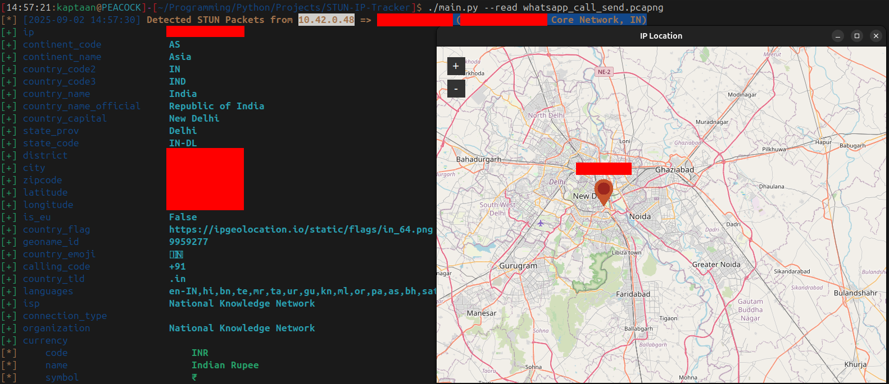
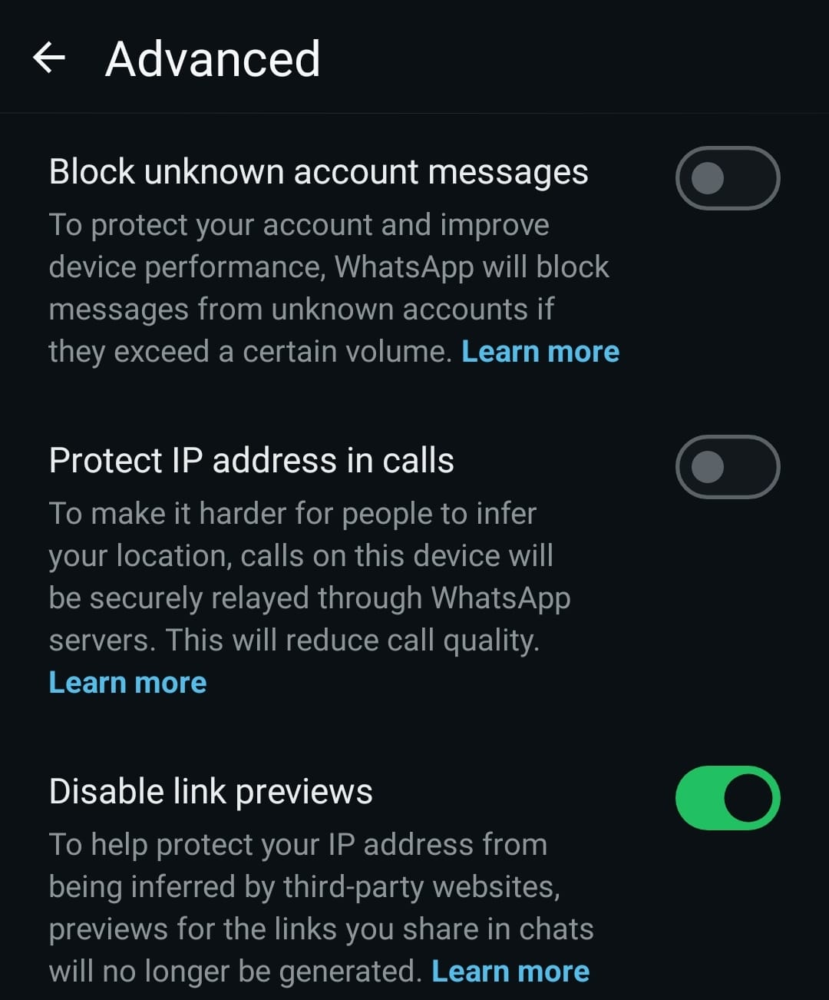

# STUN IP Tracker
A Simple Python Program that demonstrates how **Peer-to-Peer (P2P) connections**, **WebRTC**, and the **STUN protocol** can expose IP addresses.<br />
WhatsApp uses end-to-end encryption for call content, but metadata such as **IP addresses** can still leak because of **direct P2P connections**. This tool captures and analyzes **STUN packets** to show how IP addresses and approximate locations can be inferred.<br />
This program was **tested on WhatsApp 1:1 calls**, but the concept applies to **any communication app that relies on STUN for NAT traversal** (e.g., WebRTC-based calls).
## Requirements
Language Used = Python3 <br />
Modules/Packages used:
* ipwhois
* pyshark
* scapy
* colorama
* datetime
* time
* optparse
* os
* sys
<!-- -->
Install the dependencies:
```bash
pip install -r requirements.txt
```
## Setup
* Clone this repository
* Ensure `ignore_asn_names.txt` is present with ASN names you want to filter out
* Run with **root privileges** for live capture
```bash
sudo ./stun_monitor.py --iface <network-interface> --verbose true --locate true
```
It also supports reading of packet capture files for analysis<br />
```bash
./main.py --read <packet_capture_file>
```

## Background
### 1. Peer-to-Peer Connections
* In **1:1 WhatsApp calls**, traffic is exchanged **directly between devices** when possible.
* This improves **latency and call quality**, but exposes **public IP addresses** to both participants.
### 2. WebRTC
* WhatsApp relies on **WebRTC** (Web Real-Time Communication), the backbone of many modern communication apps.
* WebRTC attempts to build the **most direct route** between two devices (P2P).
* If P2P is blocked by firewalls, WebRTC uses a **TURN relay server** as fallback.
### 3. STUN Protocol (Session Traversal Utilities for NAT)
* NAT hides private IPs, but P2P requires knowing the **public IP + port mapping**.
* **STUN servers** help peers discover their public IP and port by responding to STUN requests.
* WhatsApp clients exchange **STUN packets** during call setup.
* Capturing these packets reveals the **real IP addresses** of call participants.
## Example: WhatsApp Call IP Exposure
> Alice (Delhi) calls Bob (London):
>
> * WhatsApp sets up a **direct connection** between their devices.
> * Alice learns Bob’s IP (`82.x.x.x`) and ISP (BT Broadband, London).
> * With GeoIP services, Alice can infer Bob’s **city/region**.

This does not break encryption of call content, but it **leaks metadata** that can compromise privacy.
Although WhatsApp is used here as an example, **any VoIP/WebRTC-based service that uses STUN will exhibit the same behavior**.
## Diagram
### How WhatsApp Uses STUN + P2P
```
   Alice's Phone (Private IP)             Bob's Phone (Private IP)
           192.168.1.5                            10.0.0.8
                 |                                       |
        [ NAT Router: Alice ]                   [ NAT Router: Bob ]
                 |                                       |
                 |------->  WhatsApp STUN Server  <------|
                               (Public Internet)
                 |                                       |
    Discovers Alice’s Public IP: 203.x.x.x    Discovers Bob’s Public IP: 82.x.x.x
                 |                                       |
                 |<-------  Direct P2P Connection ------>|
                             (Audio/Video Packets)
```
## Mitigation
WhatsApp provides a setting to prevent IP address exposure in calls:
**Settings → Privacy → Advanced → “Protect IP address in calls”** (off by default).
* When enabled, all calls are **relayed through WhatsApp servers** instead of direct P2P.
* This makes it much harder for people to infer your location.
* **Trade-off:** Call quality may be reduced because traffic is no longer direct.
<!-- -->

## Notes
* Works best on **Linux** (tested with Wi-Fi interfaces in monitor mode).
* Tested on **WhatsApp 1:1 calls**; concept applies to **any STUN-based communication**.
* Use for **educational/research purposes only**. Unauthorized packet sniffing may be illegal.
* Captured IPs can optionally be **geolocated and plotted on a map**.
## Further Reading
* [RFC 5389 – STUN Protocol](https://datatracker.ietf.org/doc/html/rfc5389)
* [WebRTC Official Site](https://webrtc.org/)
* [NAT Traversal in P2P](https://en.wikipedia.org/wiki/NAT_traversal)
* [WhatsApp Security Whitepaper](https://www.whatsapp.com/security/)